# 📘 MemoAI - Smart Flashcard Learning App


> MemoAI is an intelligent flashcard learning platform designed for both teachers and students. It provides an interactive way to create, assign, and review flashcards — supporting personalized learning and tracking student progress. Inspired by proven cognitive techniques like active recall and spaced repetition, MemoAI lays the foundation for smarter study habits, with AI-powered features coming soon. 

---

## 🌟 Features

### 🔐 Authentication
- 📝 **Register and Login System** with role-based access (Teacher / Student)

### 🧑‍🏫 Teacher Panel
- ✏️ **Create Flashcards** with questions, answers, and deadlines
- 🗃️ **Manage Flashcards** – edit ✏️, delete 🗑️, search 🔍, and sort 📅
- 🧑‍🎓 **Assign Flashcards to Students**
- 📊 **Monitor Student Progress** – track what’s learned ✅ and pending 🔄

### 🎓 Student Panel
- 📥 **Access Flashcards Assigned by Teachers**
- 🧠 **Review Flashcards** in interactive mode
- ✅ **Mark Flashcards as Learned**
- 📈 **Track Your Progress** – see what’s assigned and your completion %

---

## 🤖 Why “AI” in MemoAI?

MemoAI applies principles of:
- **Active Recall**: forcing the brain to retrieve information improves memory retention
- **Spaced Repetition** *(coming soon!)*: scheduling reviews at optimal intervals based on forgetting curves

These are core techniques used in **AI-driven memory systems**. The app simulates this smart approach to help users **learn faster and smarter**.

---

## 🛠️ Tech Stack

- 💻 **Frontend**: HTML5, CSS3
- 🐍 **Backend**: Python (no framework used)
- 🗃️ **Database**: SQLite with SQLAlchemy ORM
- 🔐 **Authentication**: Custom login system with roles (Teacher / Student)

---

## 🧩 Folder Structure

memoai/
├── static/
│ └── css/
│ ├── assign_flashcards.css
│ ├── background.css
│ ├── home.css
│ ├── register.css
│ ├── login.css
│ ├── dashboard.css
│ ├── edit.css
│ ├── flashcards.css
│ ├── manage_flashcards.css
├── templates/
│ ├── home.html
│ ├── register.html
│ ├── login.html
│ ├── teacher_dashboard.html
│ ├── student_dashboard.html
│ ├── create_flashcard.html
│ ├── edit_flashcard.html
│ ├── manage_flashcards.html
│ ├── assign_flashcards.html
│ └── student_progress.html
├── screenshots
├── mainfile.py
├── models.py
├── database.py
└── requirements.txt


---

## 📁 Important Files

| File | Purpose |
|------|---------|
| `mainfile.py` | Main entry point |
| `models.py` | SQLAlchemy models |
| `database.py` | DB setup and session |
| `requirements.txt` | Python dependencies |
| `.gitignore` | Ignores `.db`, `__pycache__`, etc. |
| `LICENSE` | MIT License for open use |
| `README.md` | Project overview and docs |

---

## ⚠️ Excluded Files

| File | Reason |
|------|--------|
| `memoai.db` | Local database — auto-created when app runs |
| `__pycache__/` | Python build files — not needed in repo |
| `.env` | If used — should stay private |

---
## 📷 Screenshots

### 🏠 Home Page
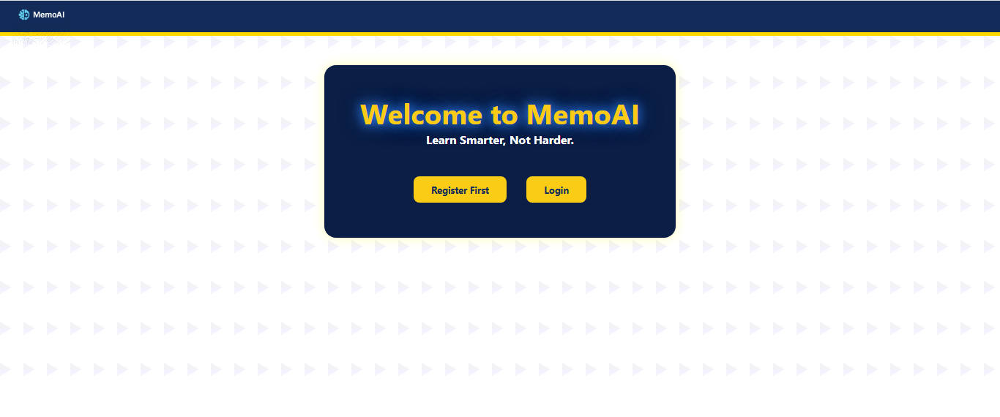

### 📝 Registration Page
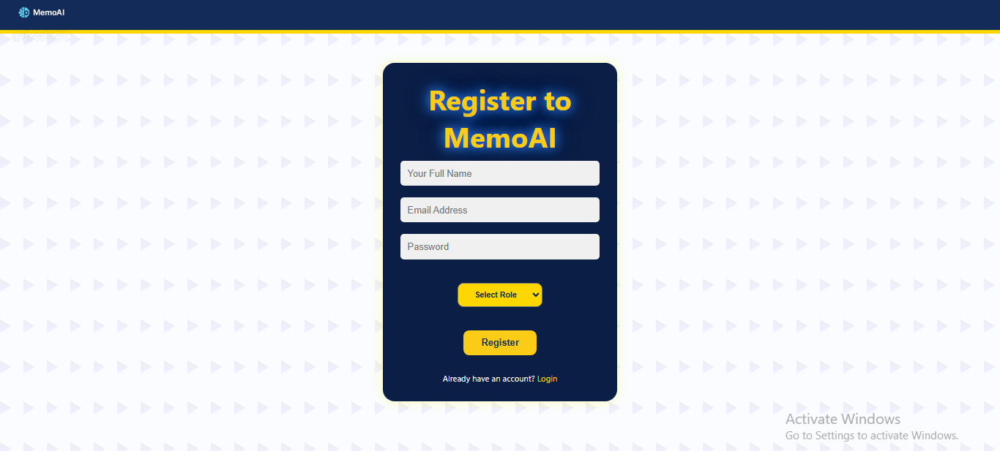

### 🔑 Login Page
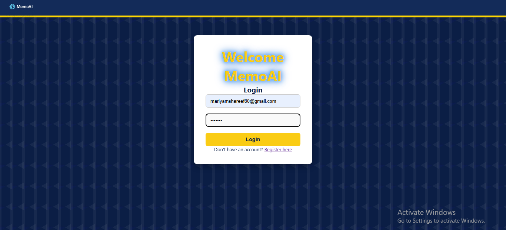

### 🙋‍♀️ Teacher Dashboard
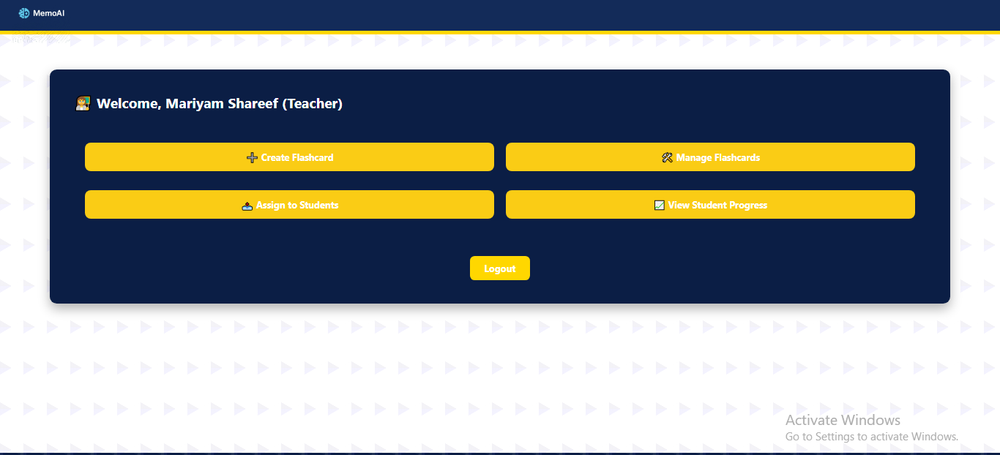

### 📝 Create Flashcard Form
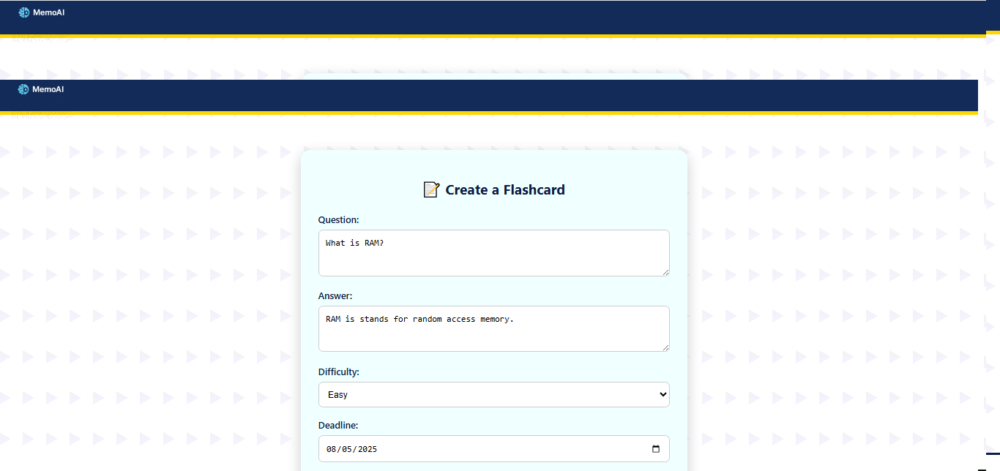

### 📊 Student Progress View
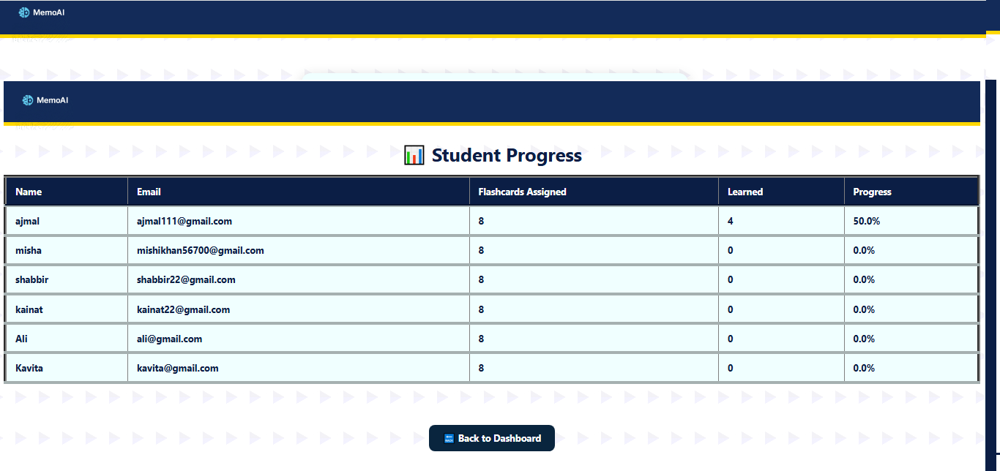

### 🗃️ Manage Flashcard Page
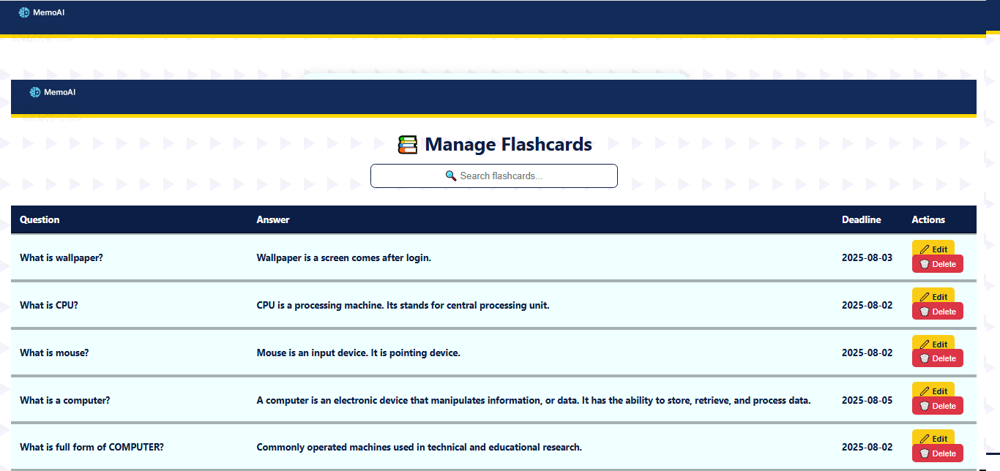

### ✏️ Edit Dashboard
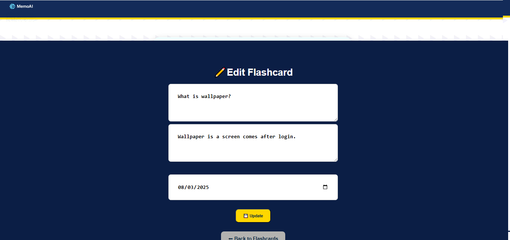

### 📝 Assign Flashcard Page
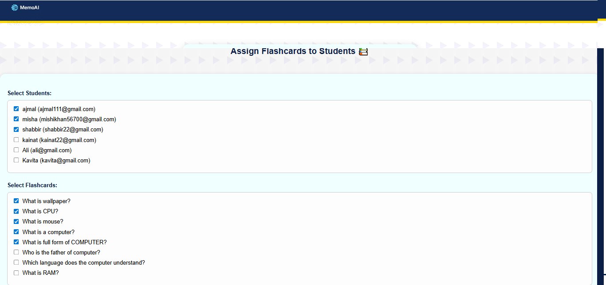

### 🎓 Student Dashboard
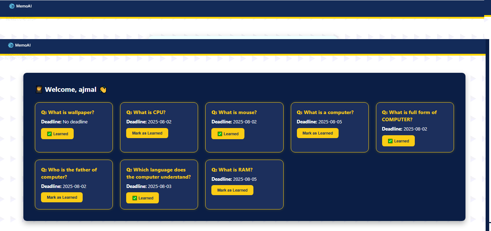

### 🧑‍🏫 Student Dashboard Flip Answers
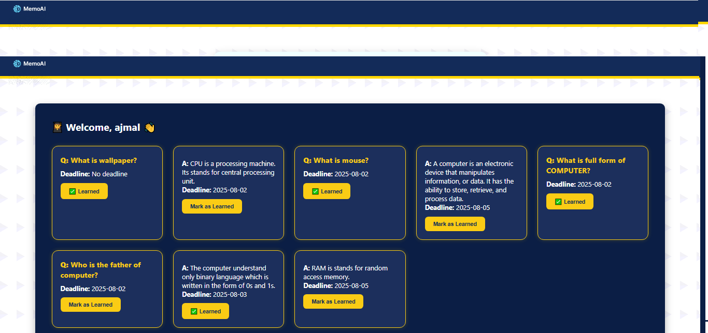

## ⚙️ Installation & Setup

```bash
git clone https://github.com/your-username/MemoAI.git
cd MemoAI
pip install -r requirements.txt
python mainfile.py
App will run on http://localhost:5000/

## 🚀 Future Plans

- ⏰ Timer-based Review Mode
- 📅 Spaced Repetition Logic (Leitner System)
- 📥 Export Progress Reports to Excel/CSV
- 🧠 AI Suggestions for Next Study Cards
- 🌐 Web-based deployment using Flask or Django

---

## 📄 License

> This project uses the MIT License — you’re free to use and share it! See [LICENSE](LICENSE) for full terms.

---

## 🙋‍♀️ Created with💙by Mariyam Shareef
E-mail: mariyamshareef80@gmail.com
